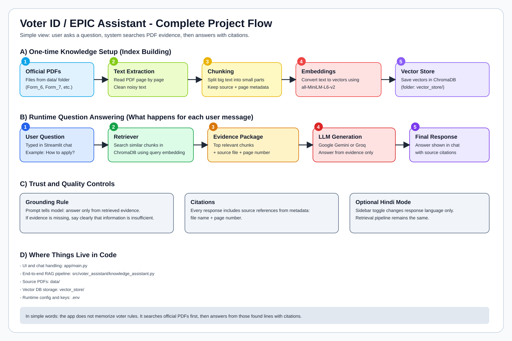
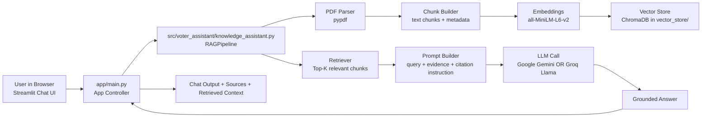
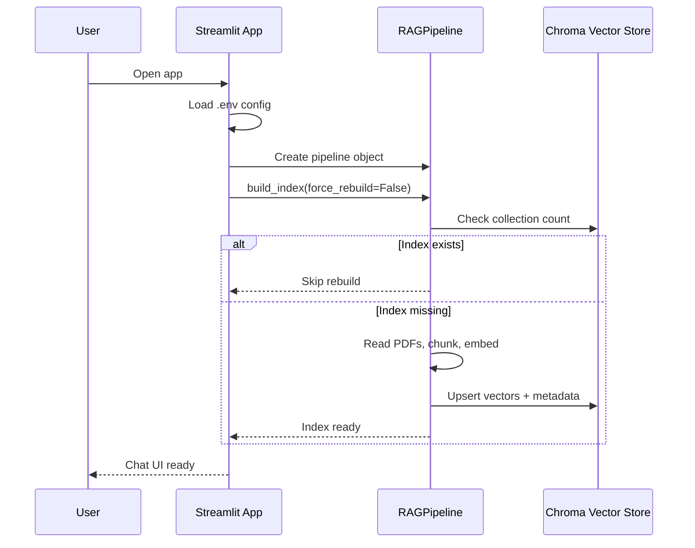
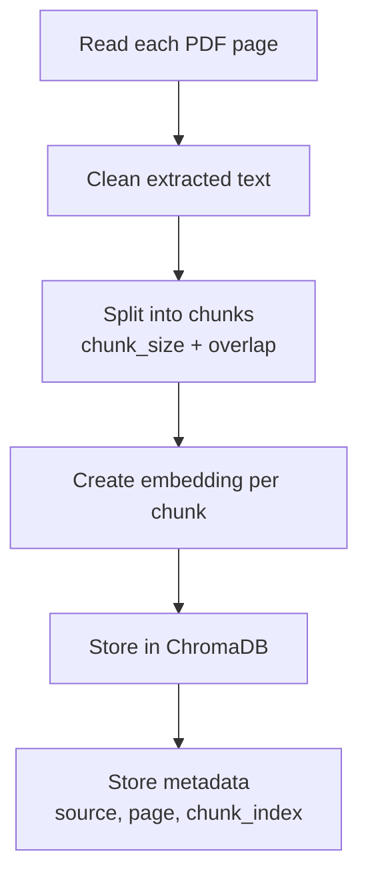
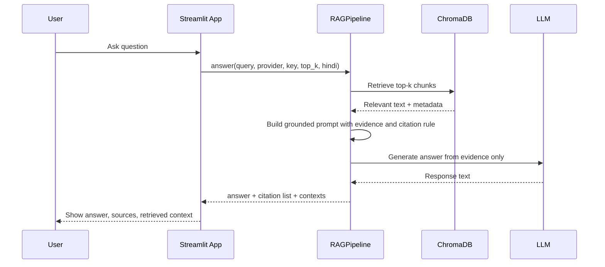

# Voter ID / EPIC Assistant - High Level Architecture



This document explains the complete project in very simple language.

If you are new to RAG systems, read this top to bottom once. You will understand:
- what the app does,
- how data moves,
- how answers are created,
- where citations come from,
- which files are responsible for each part.

---

## 1) What This Project Does

This project is a chatbot for voter ID (EPIC) help.

You ask a question in the Streamlit chat UI.
The app:
1. searches the official PDFs in the `data/` folder,
2. finds the most relevant text pieces,
3. sends only those pieces to an LLM,
4. generates an answer,
5. shows source citations.

Important point:
The chatbot is retrieval-based. It does **not** train a model.

---

## 2) Big Picture Architecture



---

## 3) Main Building Blocks

### 3.1 UI Layer
- File: `app/main.py`
- Responsibility:
  - show chat interface,
  - read configuration from `.env`,
  - trigger index build,
  - send question to pipeline,
  - display answer + citations.

### 3.2 RAG Pipeline Layer
- File: `src/voter_assistant/knowledge_assistant.py`
- Class: `RAGPipeline`
- Responsibility:
  - parse PDFs,
  - split text,
  - create embeddings,
  - store embeddings in Chroma,
  - retrieve relevant chunks,
  - build grounded prompt,
  - call selected LLM,
  - return answer + citations + retrieved context.

### 3.3 Data Layer
- Source documents: `data/*.pdf`
- Vector database files: `vector_store/`
- Stored metadata per chunk:
  - source file name,
  - page number,
  - chunk index.

### 3.4 LLM Provider Layer
- Provider is controlled by `.env`:
  - `LLM_PROVIDER=google` or `LLM_PROVIDER=groq`
- Google key: `GOOGLE_API_KEY`
- Groq key: `GROQ_API_KEY`

---

## 4) Startup Flow (What Happens When App Starts)



Simple meaning:
- If index already exists, app starts quickly.
- If index does not exist, app builds it once.

---

## 5) Index Build Flow (Offline Knowledge Preparation)



### Why chunking is needed
Large pages are split into smaller pieces so search is precise.

### Why metadata is needed
Metadata allows us to display citations like:
- Form_6.pdf (page 1)

---

## 6) Question Answering Flow (Online Runtime)



---

## 7) Prompt Grounding Rules

The pipeline tells the LLM to:
1. answer only from retrieved evidence,
2. say clearly when evidence is insufficient,
3. cite sources for factual points,
4. optionally answer in Hindi when toggle is ON.

This reduces hallucination risk.

---

## 8) Configuration Model

Runtime configuration is server-side using `.env`.

Typical `.env`:

```env
LLM_PROVIDER=google
GOOGLE_API_KEY=your_key_here
GROQ_API_KEY=
HINDI_MODE=false
RETRIEVED_CHUNKS=4
```

Meaning:
- `LLM_PROVIDER`: select backend LLM.
- `HINDI_MODE`: default Hindi mode on startup.
- `RETRIEVED_CHUNKS`: how many evidence chunks to fetch.

---

## 9) Error Handling Strategy

Where errors are handled:
- App layer (`app/main.py`) wraps generation call in try/except.
- If LLM call fails, user sees readable error message in chat.

Special handling in Google path:
- pipeline tries multiple Gemini model IDs if one model ID fails.

---

## 10) File-by-File Responsibility Map

- `app/main.py`
  - UI, config, user interaction, render outputs.
- `src/voter_assistant/knowledge_assistant.py`
  - complete RAG engine.
- `data/`
  - source PDFs.
- `vector_store/`
  - persisted Chroma index.
- `notebooks/voter_id_assistant_notebook.ipynb`
  - notebook walkthrough/testing.
- `.env`
  - secret keys and runtime config (not committed).
- `.env.example`
  - safe template for config variables.

---

## 11) End-to-End Summary in One Paragraph

User asks a voter-related question in Streamlit. The app sends this question to the RAG pipeline. The pipeline searches vectorized PDF chunks in ChromaDB, gets the most relevant evidence, builds a strict grounded prompt, and calls the selected LLM (Google or Groq). The model answers only using that evidence, and the app displays both the answer and source citations so the user can verify where information came from.

---

## 12) Current Design Limits (Important for Understanding)

- Quality depends on quality and coverage of PDFs in `data/`.
- If PDF text is missing/unclear, answer will be limited.
- If documents list is not explicitly written in PDF text, app cannot invent missing details (by design).

This behavior is intentional and aligned with retrieval-grounded chatbot design.
